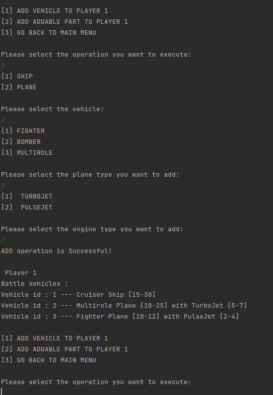

# Battle Game Simulation

## Introduction

- **Battle Game Simulation** simulates the players battling against each other with their battle vehicles.

- In the game; players can have  battle vehicles like ship, plane and  they can also add parts to their vehicles.

- Every battle vehicle and its parts  have a point range, which means that points are randomly assigned to them between related their point range.

- When simulation is run, points are assigned to the users' vehicles, summed and compared. Based on the comparison, the player having the highest point wins the game.

- Simulation can be run more than once. Each time simulation is run, points for each side will be calculated again. It means that for the
same vehicles, result of simulation may change.

## Structure

- Project was implemented by using **Abstract Factory Design Pattern** and **Decorator Design Pattern**.

- To create different kind of vehicles, **Abstract Factory Design Pattern** was used.

- When adding parts to vehicles; to calculate the total points of the parts and their vehicles, **Decorator Design Pattern** was used.

- Project can be tested and run in the *Test* package.

## Screenshots

   

  
